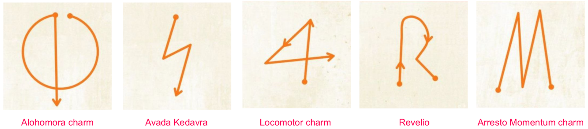

# Robust Magic Want Toy AI Example on Arduino Nano 33 BLE Sense
The source files in this directory contains just the minimal code to show the data collection and training. The full repository is available at https://github.com/xmihol00/robust_magic_wand. The repository was created as part of the **Algorithms and Selected Topics Communications and Mobile Computing (Embedded Machine Learning)** course on TU Graz, in winter semester 2022/23.

## Currently Available Spells
